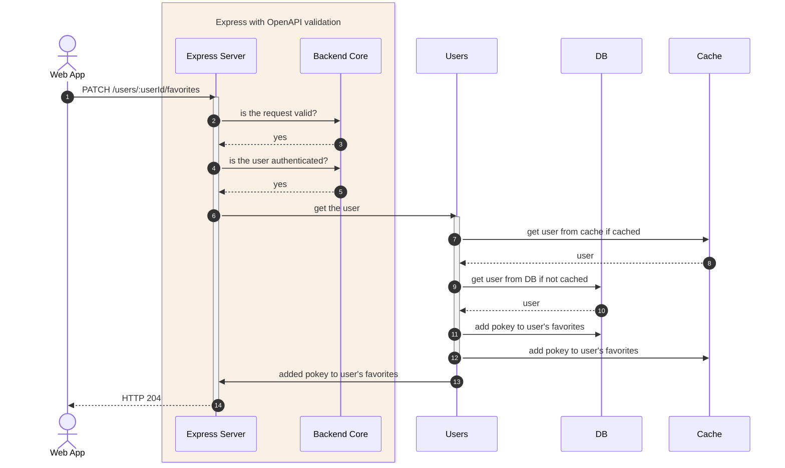

# Trading Game Cards MVP

This is a **high fidelity** trading game cards MVP built with Typescript, Node.js, Postgres, Drizzle, Redis, OpenAPI, and Docker. It is a monorepo that features a vanilla HTML/Javascript/CSS + Bootstrap frontend as well as a React + Tailwind frontend, both of which communicate (with a [shared client-core](/shared/server/client/client-core)) to the same backend that implements a RESTful API spec-ed with OpenAPI 3.x

The goal of this project is to create a simple, yet fully functional, testable, and deployable MVP to **showcase a robust starting point** to early stage startups and entrepreneurs looking to get ahead and quickly go from idea to functionaly MVP.

## Features & Highlights

> See it in action at [https://trading-cards-react-mvp.netlify.app/](https://trading-cards-react-mvp.netlify.app)

- A PostgreSQL database with data migrations support (via [drizzle-kit](https://github.com/drizzle-team/drizzle-kit))
- Externalized configuration with type-safe environment variables
- Utilises Redis caching and supports HTTP caching
- A well designed and [documented REST API](https://trading-cards-backend-staging.up.railway.app/docs/) using the OpenAPI 3.x specification
- Modern integration testing with TestContainers
- Dockerized with Docker Compose and a Dockerfile
- First class support for TypeScript and pervasive type safety, both in source code and in tests. API controllers and services heavily use types generated from the OpenAPI spec as well as others put together by hand :point_down: :point_down:    
    

## Wanna Take It For A Spin :sunglasses:

Review the deployed app online :rocket:

- React App - https://trading-cards-react-mvp.netlify.app
- Vanilly HTML/JS App - https://trading-cards-vanilla-js-mvp.netlify.app
- Backend - https://trading-cards-backend-staging.up.railway.app
- API Docs - https://trading-cards-backend-staging.up.railway.app/docs/

## Technology Stack

### Backend
- Typescript
- Node.js
- Express
- OpenAPI 3.x
- PostgreSQL
- Drizzle ORM
- Redis

### Frontend 
- Typescript
- React
- HTML/CSS
- Bootstrap
- Tailwind CSS
- Parcel

### CI/CD, Testing, and Packaging
- Mocha
- Docker
- Github Actions
- TestContainers

### Running Tests

[Github Actions will run the tests](https://github.com/mvpchops/trading-cards/actions/runs/10248704190/job/28350534204) on push to the `dev` branch and on pull requests to `dev` and `main` branches

## System Components

   
### Searching for game cards
---

   
### Adding a card to a user's favorites
---

## Contact

If you have any questions, comments or would like to discuss your MVP, feel free to reach out via email at [mvpchops@gmail.com](mailto:mvpchops@gmail.com)

